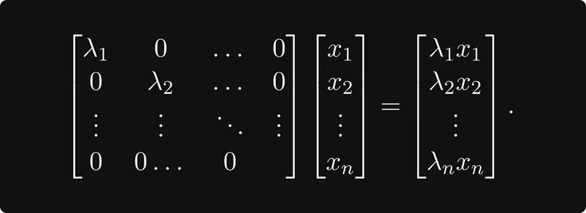

<div align="center">

<!-- BANNER -->


<br/>

<!-- SYSTEM SIGNATURE -->
# Malcom Kamau // Full Stack Developer
### 「 Building Scalable Systems 」

<a href="https://git.io/typing-svg">
  
</a>

<br/>

<!-- NAVIGATION HUD -->
[](https://porfolio-malcomgakuo.vercel.app)
[](mailto:malcomkamau504@gmail.com)
[](https://github.com/malcomkamau)
</div>

---

<!-- ABOUT ME REDESIGN -->
<table border="0">
  <tr>
    <td width="65%" valign="top">
      <h1> Hello, I'm Malcom! </h1>
      <p>
        I'm a <b>Full Stack Developer</b> and <b>Systems Engineer</b> based in Kenya. I enjoy building things that are both technically complex and easy to use. 
      </p>
      <br/>
      <h4> CURRENT_FOCUS </h4>
      <ul>
        <li> <b>Operating Systems:</b> Building my own kernel using Rust. </li>
        <li> <b>Web Apps:</b> Creating fast and scalable websites. </li>
        <li> <b>Systems:</b> Exploring the bridge between software and hardware. </li>
      </ul>
    </td>
    <td width="35%" align="center" valign="middle">
      <div style="border: 2px solid #555; border-radius: 15px; padding: 10px; background: #000;">
        
        <p style="color: #888; font-family: monospace; font-size: 10px; margin-top: 5px;">「 VISUAL_FEED_01 」</p>
      </div>
    </td>
  </tr>
</table>

---

### Current Projects
| Project Name | Tech Stack | Status |
| :--- | :--- | :--- |
| **E-Commerce Ecosystem** | `React // Node.js` | `Stable` |
| **Custom Rust Kernel** | `Rust // x86_64` | `In Development` |
| **Network Infrastructure** | `Cisco // Linux` | `Active Learning` |

---

### Technologies
<div align="center">
  <br/>
  
  <br/>
</div>

<br/>

---

### My Stats
<p align="center">
  
  
</p>
<br/>
<p align="center">
  
</p>

---

### My Setup
```json
{
  "hardware": ["Raspberry Pi", "Custom Desktop PC", "Nvidia Jetson"],
  "operating_systems": ["Kali Linux", "Windows"],
  "tools": ["Docker", "Git", "VS Code"]
}
```